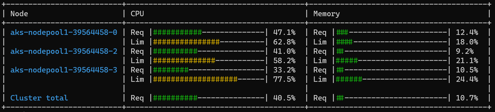

# Description

Utility for retrieving the status of resource requests across nodes in a Kubernetes cluster

## Sample output

## Known issues
If using Azure AD as authentication, you might run into errors where it fails to authenticate.

Since this script merely loads your kubeconfig, it doesn't do any token refresh or anything like that - so, if when this problem pops up you can just issue a `kubectl <something>` command against your cluster and the tokens should be refreshed and the script can run.
